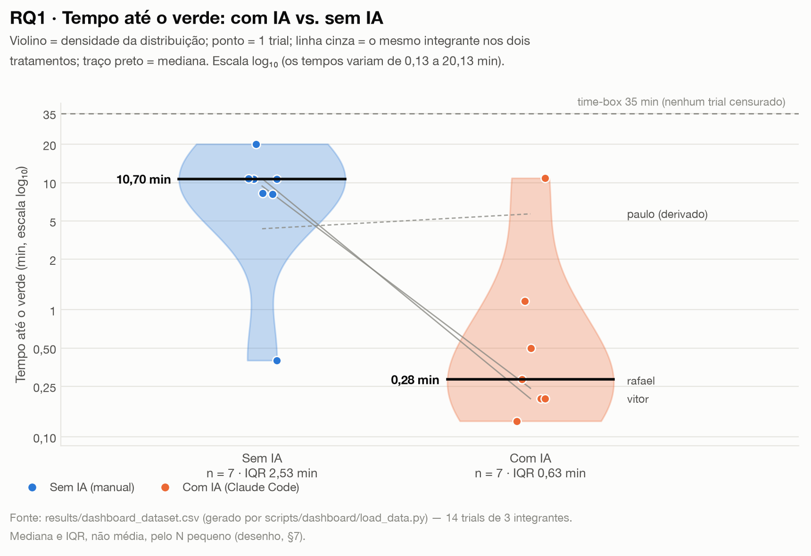
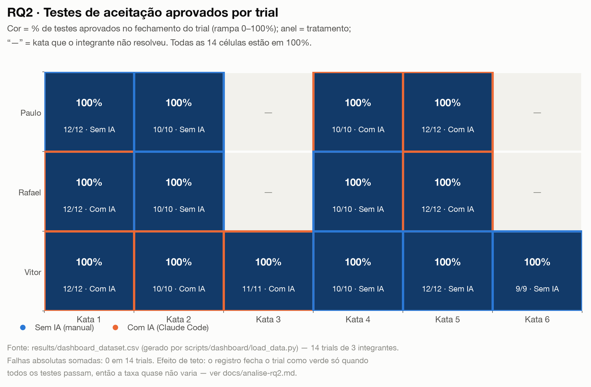
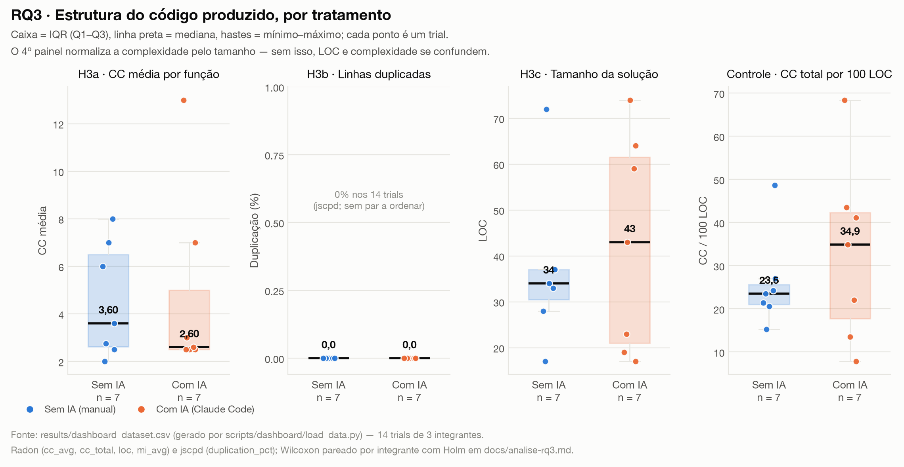
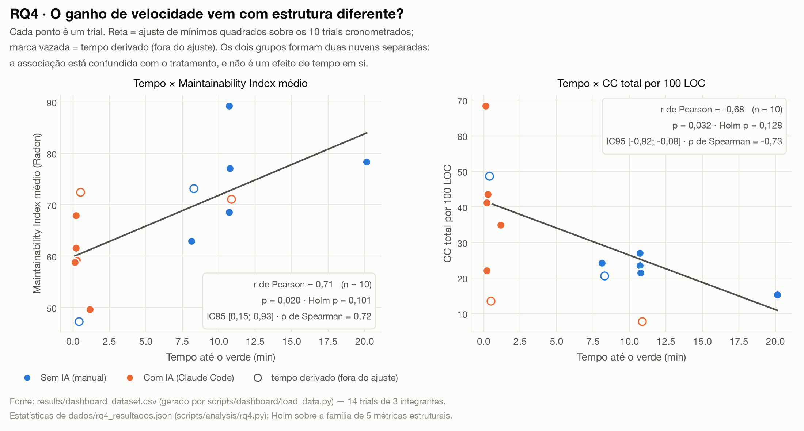
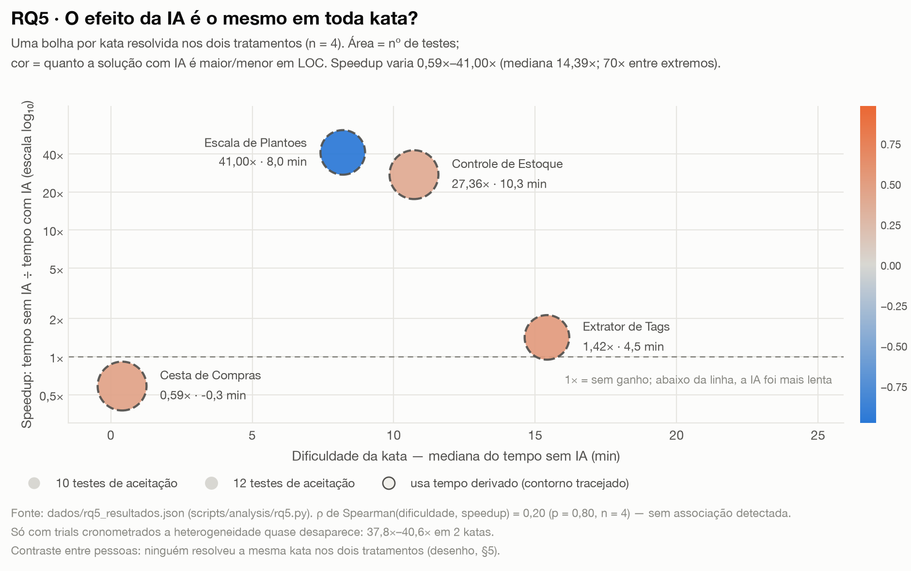

# Relatório de Laboratório

**Assistentes de IA vs. codificação manual: um experimento controlado**

| | |
|---|---|
| **Curso** | Engenharia de Software |
| **Disciplina** | Laboratório de Experimentação de Software |
| **Turno / Período** | Noite / 6º |
| **Professor(a)** | Danilo Maia |
| **Laboratório** | Lab02 — Assistentes de IA vs. Codificação Manual |
| **Grupo (trio)** | Paulo Assis · Rafael Franco · Vitor Rebula |
| **Link do repositório / GitHub Projects** | `<preencher — obrigatório>` |
| **Data de entrega** | `<preencher>` |

---

## 1. Introdução

Ferramentas de IA generativa entraram no fluxo de trabalho de desenvolvimento
mais rápido do que a evidência sobre elas. O que circula é majoritariamente
anedótico — "ficou muito mais rápido", "o código veio pior" — sem controle de
quem programa, de qual tarefa, nem de como se mede "melhor". Este laboratório
troca o relato pelo **experimento controlado**: três integrantes resolvem katas
de dificuldade comparável, metade com assistente de IA e metade sem, em ordem
contrabalanceada e com time-box fixo de 35 minutos, medindo tempo, corretude e
estrutura do código com instrumentação automatizada.

### Questões de pesquisa

**Do enunciado (70%):**

- **RQ1 — tempo.** O uso de assistente de IA reduz o tempo necessário para
  resolver uma tarefa de programação (*time-to-green*)?
- **RQ2 — defeitos.** O uso de assistente de IA reduz a quantidade de defeitos
  (testes de aceitação que falham) no código produzido?
- **RQ3 — estrutura.** O uso de assistente de IA altera a complexidade
  ciclomática ou a duplicação do código produzido?

**Propostas pelo grupo (30% de inovação):**

- **RQ4 — trade-off velocidade × estrutura (RQ extra).** Existe associação
  entre o tempo até o verde e as métricas estruturais do código entregue (LOC,
  complexidade, densidade de complexidade, *Maintainability Index*)?
- **RQ5 — heterogeneidade do efeito (diferencial do grupo).** O efeito do
  assistente sobre o tempo é homogêneo entre as katas, ou depende da
  dificuldade intrínseca da tarefa?

### Hipóteses informais, registradas antes de olhar os dados

| RQ | Hipótese informal do grupo |
|---|---|
| RQ1 | A IA reduz o tempo, e de forma acentuada em katas curtas e bem especificadas. |
| RQ2 | Sem direção esperada: há argumentos nos dois sentidos (mais código por unidade de tempo pode gerar mais ou menos defeitos). |
| RQ3 | O código gerado com IA tende a ser **mais longo** e **mais duplicado**. |
| RQ4 | Espera-se troca: quem termina mais rápido entrega código maior e menos cuidado. |
| RQ5 | O ganho cresce com a dificuldade — katas triviais já são rápidas na mão. |

Todos os testes foram declarados **bicaudais** a priori (α = 0,05) no
[desenho do experimento](desenho-experimento.md): a direção esperada acima é
leitura secundária, e mudar para teste unicaudal depois de ver os dados seria
*p-hacking*.

**Resumo das inovações (uma linha cada):** (a) **RQ4**, que mede associação
entre tempo e estrutura em vez de comparar tratamentos; (b) **RQ5**, que
reanalisa os mesmos dados por kata em vez de por integrante; (c) **métricas
adicionais** não pedidas — densidade de complexidade (CC/100 LOC) e
*Maintainability Index*; (d) **metodologia complementar** — IC 95% de Pearson
por *z* de Fisher, ρ de Spearman em paralelo, correção de Holm-Bonferroni por
família de hipóteses e **análise de sensibilidade obrigatória** separando dado
cronometrado de dado derivado; (e) **cinco tipos de gráfico**, um por RQ,
escolhidos pelo tipo de pergunta. Detalhamento em §3.6.

## 2. Contexto

### Contexto acadêmico

Este é o **Lab02** da disciplina, o primeiro em que o grupo é simultaneamente
**experimentador e sujeito**: os dados não vêm de uma API pública (como na
mineração de repositórios do Lab01), e sim da própria execução dos integrantes
sob condições controladas. Isso muda a natureza dos riscos: em vez de *rate
limit* e paginação, os problemas são de **protocolo** — garantir que o
tratamento seja o mesmo em todos os trials, que o cronômetro meça o que diz
medir, e que ninguém veja a solução antes.

### Objeto de estudo

O objeto medido é **o processo de resolver uma kata**, em duas condições:

- **`ai`** — kata resolvida **com** Claude Code, que lê e edita os arquivos do
  trial diretamente (não é chat externo com copiar/colar);
- **`manual`** — kata resolvida **sem** qualquer assistente de IA: nenhum
  autocomplete com IA habilitado, nenhum chat, nenhuma consulta a LLM.

Consulta a documentação, Stack Overflow e busca web é **permitida nos dois
tratamentos** — o fator isolado é o assistente de IA, não o acesso a
informação.

### Base teórica e metodológica

- **GQM** (Basili, Caldiera & Rombach) — estrutura *Goal → Question → Metric*
  que organiza o laboratório: o *goal* do enunciado, RQ1–RQ5 como *questions* e
  a tabela de §3.5 como *metrics*.
- **Wohlin et al., *Experimentation in Software Engineering*** — formato do
  *goal template*, o desenho crossover *within-subject* contrabalanceado, a
  taxonomia de ameaças à validade (interna, construto, externa, conclusão) e a
  exigência de declarar a análise estatística antes da coleta.
- **McCabe (1976)** — complexidade ciclomática; **Radon** como implementação
  para Python (CK foi descartado por exigir Java).
- **Halstead / Maintainability Index** — base do `mi` do Radon, usado como
  métrica composta opcional.

## 3. Metodologia

### 3.1 Principais desafios

1. **Katas de dificuldade equivalente e pouco indexadas.** O enunciado alerta
   para memorização: se a kata for um clássico do LeetCode, o assistente
   reproduz uma solução vista no treinamento em vez de "ajudar". O grupo
   escreveu **6 katas autorais**, cada uma em um domínio distinto (regras de
   negócio, intervalos de tempo, validação, parsing, estado mutável, máquina de
   estados), com suíte de aceitação e solução de referência mantida fora do
   pacote dos participantes. Equivalência não é demonstrável formalmente — é
   argumentada em [katas_justificativa.md](katas_justificativa.md) e continua
   como ameaça.
2. **Medir tempo de forma auditável.** "Cronometrar no celular" não sobrevive a
   uma revisão. Foi preciso escrever um script que marca o início, roda `pytest`
   em intervalos, fecha o trial no primeiro verde e **registra censura em 35 min**
   em vez de descartar o trial. Mesmo assim, 4 dos 14 trials acabaram com tempo
   **derivado** em vez de cronometrado (§4.1) — o maior problema do estudo.
3. **O efeito de teto de RQ2.** Descoberto ainda no desenho: como o registro só
   fecha o trial como verde quando **todos** os testes passam, a taxa de
   aprovação vale 100% por construção em todo trial verde. A variável só varia
   entre censurados — e não houve nenhum. Está declarado como alerta de
   operacionalização no próprio desenho (§3), não foi descoberto depois.
4. **Complexidade e tamanho se confundem.** `cc_total` cresce com o arquivo,
   então "IA produz código mais complexo" pode ser só "IA produz mais linhas".
   Exigiu introduzir a **densidade de complexidade** (CC total / 100 LOC) como
   controle, além da LOC que o enunciado já pede.
5. **Pareamento sem repetir kata.** O crossover clássico pede a mesma tarefa nas
   duas condições — inviável aqui, porque resolver a mesma kata duas vezes torna
   o segundo trial trivial. A solução (katas diferentes por tratamento) elimina
   o *carryover*, mas **impede o par "mesma pessoa, mesma kata"**, o que reduz o
   Wilcoxon a 2–3 pares e força a agregação por integrante.
6. **Integridade dos dados entre quatro fontes.** `timing.json`, `timing.csv`,
   `static_metrics.csv` e os diretórios de `trials/` precisam concordar na tripla
   `(integrante, kata, tratamento)`. Um commit de limpeza apagou dois trials e
   deixou suas métricas para trás, quebrando a reprodução do consolidado — ver
   §4.1 e [checklist-entregaveis.md](checklist-entregaveis.md) §6.

### 3.2 Tomadas de decisão

| Decisão | Alternativa descartada | Por quê |
|---|---|---|
| **Python 3.10+** como linguagem | Java | CK exige Java; o grupo tem mais fluência em Python, e Radon + jscpd cobrem CC, LOC, MI e duplicação. Fixar a linguagem pela ferramenta de métricas é o que o enunciado recomenda. |
| **Radon** (CC, LOC, MI) + **jscpd** (duplicação) | CK + PMD CPD | consequência direta da escolha da linguagem. |
| **Claude Code** como assistente único | Copilot, ChatGPT | o enunciado exige o **mesmo** assistente em todos os trials; a escolha caiu no que o grupo tinha acesso estável. **Ressalva honesta:** os trials de Paulo foram feitos com **ChatGPT**, o que viola essa decisão e está reportado como ameaça (§4.3). |
| **Time-box de 35 min**, sem redução | reduzir para 20 min | o enunciado permite reduzir, não aumentar; manter 35 preserva comparabilidade com os outros grupos da turma. |
| **Katas autorais** | LeetCode/HackerRank | reduzir o risco de memorização pelo assistente (§3.1). |
| **4 katas por integrante** (2+2) | 6 katas (3+3) | orçamento de tempo do trio; Vitor executou 6, os extras entram como `no_plano_4_katas=false` e ficam fora do conjunto balanceado. |
| **Mediana e IQR** em toda tabela e figura | média e desvio-padrão | N pequeno e distribuição assimétrica; é também o que o enunciado pede explicitamente. |
| **Censura registrada em 35 min** | descartar o trial | descartar distorce a comparação a favor do tratamento com mais falhas. Implementado, embora não tenha havido censurados. |
| **Unidade de análise = integrante** | o trial | o desenho é *within-subject*; tratar 14 trials como independentes infla o n e ignora a habilidade individual. |
| **Holm-Bonferroni por família** (RQ3: 3 hipóteses; RQ4: 5) | nenhuma correção | com 5 correlações, a chance de um `p < 0,05` por acaso passa de 20%. Aplicar a correção **inverteu a conclusão** de RQ4 (§4.3). |
| **Tempos derivados preservados e sinalizados** | apagar da base | apagar esconde o problema; a solução foi mantê-los com `fonte_tempo` e excluí-los das análises primárias, reportando sensibilidade. |
| **Limite de WIP no board** | sem limite | `<preencher: limite adotado na coluna Doing e justificativa>` |

### 3.3 Etapas

| Sprint | Entregas | Responsável(is) | Issues |
|---|---|---|---|
| **Lab02S01** | Desenho do experimento (hipóteses, variáveis, crossover, ameaças) | Rafael Franco | #1 |
| | Ameaças à validade (documento detalhado) | Paulo Assis | #2 |
| | 6 katas autorais + suítes de aceitação + justificativa de equivalência | Paulo Assis | #3 |
| | Script de cronometragem do *time-to-green* (time-box 35 min, censura) | Rafael Franco | #4 |
| | Script de coleta de métricas estáticas (Radon + jscpd) | Vitor Rebula | #5 |
| | Documentação do ambiente (linguagem, IDE, assistente) | Vitor Rebula | #6 |
| **Lab02S02** | 4 trials (kata1 IA, kata2 manual, kata4 manual, kata5 IA) + relatórios de trial | Rafael Franco | #23–#27 |
| | 6 trials (katas 1–6, 3 IA / 3 manual) + correção do `timing.json` | Vitor Rebula | #23, #25, #26, #27 |
| | Soluções das 6 katas + registro de tempos + organização dos trials | Paulo Assis | #17–#21 |
| **Lab02S03** | Revisão dos dados, consolidação e outliers | Paulo Assis | #44 |
| | Análise estatística de RQ1 e RQ2 (Wilcoxon, censura, taxa de sucesso) | Paulo Assis | #45, #46 |
| | Análise das métricas estáticas — RQ3 (Wilcoxon + Holm + normalização) | Paulo Assis | #47 |
| | Pipeline de importação/consolidação do dashboard | Rafael Franco | #48 |
| | Gráficos comparativos por RQ | Rafael Franco | #49 |
| | Dashboard (notebook) com testes e síntese | Rafael Franco | #43, #50 |
| **Relatório Final** | RQ4 (extra), RQ5 (diferencial), 5 figuras por RQ, este documento | `<preencher>` | #50 |

> **Pendência de processo a resolver antes da entrega:** não há commit de
> **Vitor Rebula** na S03, e o enunciado zera a parcela individual do integrante
> sem artefato de código na sprint. Ver [checklist-entregaveis.md](checklist-entregaveis.md) §7.

#### Configuração do processo

- **Colunas do board:** `<preencher — mínimo Backlog → To Do → Doing → Review → Done>`
- **Limite de WIP:** `<preencher — limite na coluna Doing e justificativa>`
- **Rastreabilidade trial ↔ Issue:** uma Issue por trial (kata × tratamento),
  com Assignee do responsável.
- **Print do board ao final do laboratório:** `<inserir imagem>`

### 3.4 Ferramentas

| Ferramenta | Versão / detalhe | Uso |
|---|---|---|
| Python | 3.10+ (auditoria executada em 3.14) | linguagem das katas e de todos os scripts |
| pytest | ≥ 7.4 | suítes de aceitação; o coletor precisa de `-o "python_files=test_*.py teste_*.py *_test.py"`, pois os arquivos se chamam `teste_aceitacao.py` |
| Radon | ≥ 6.0.1 | `cc_avg`, `cc_total`, `loc`, `sloc`, `mi_avg` |
| jscpd | via npx | `duplication_pct` (% de linhas duplicadas) |
| Claude Code | Opus 5 / Sonnet, conforme o trial | assistente de IA do tratamento `ai` |
| pandas | ≥ 2.0 | consolidação e dataset único do dashboard |
| Matplotlib | ≥ 3.7 | as 11 figuras (violino, heatmap, box plot, dispersão, bolhas) |
| SciPy | ≥ 1.11 | Wilcoxon exato, Pearson, Spearman, Shapiro-Wilk |
| NumPy | ≥ 1.24 | percentis, medianas, ajuste de mínimos quadrados |
| JupyterLab | ≥ 4.0 | dashboard (`scripts/dashboard/dashboard.ipynb`) |
| Git + GitHub Projects (v2) | — | versionamento e board do processo |

Scripts próprios do grupo (nenhuma biblioteca de terceiros faz a coleta):
`scripts/timing/track_time.py`, `scripts/metrics/collect_metrics.py`,
`scripts/analysis/{consolidate_s02,rq1,rq2,rq3,rq4,rq5}.py`,
`scripts/dashboard/{load_data,plots,plots_advanced}.py`.

### 3.5 Tabela de métricas

| RQ | Métrica | Definição operacional | Unidade | Ferramenta / fonte |
|---|---|---|---|---|
| RQ1 | `time_to_green_min` | tempo do início do trial até **todos** os testes de aceitação passarem; **censurado em 35 min** se o time-box estourar | minutos (razão, censurada à direita) | `track_time.py` → `results/timing.json` |
| RQ1 | `event` / `censored` | 1 se o verde foi observado dentro do time-box; 0 se censurado | binária | idem |
| RQ1 (expl.) | nº de prompts | interações com o assistente no trial `ai` | contagem | nota do trial / `PROMPTS.md` |
| RQ2 | `pct_tests_passing` | `100 × tests_passed / (tests_passed + tests_failed)` no fechamento do trial | % | `pytest`, via `track_time.py` |
| RQ2 | falhas absolutas | `tests_total − tests_passed` | contagem | idem |
| RQ2 | taxa de sucesso | trials que atingiram o verde ÷ trials **com desfecho conhecido** | % | derivada |
| RQ3 / H3a | `cc_avg` | complexidade ciclomática (McCabe) média por função do código de solução | adimensional | Radon `cc` |
| RQ3 / H3b | `duplication_pct` | % de linhas duplicadas no código de solução | % | jscpd |
| RQ3 / H3c | `loc` | linhas de código do arquivo de solução (`sloc` = sem brancos/comentários) | linhas | Radon `raw` |
| RQ3 (controle) | `densidade_cc` | `100 × cc_total / loc` — complexidade normalizada pelo tamanho | CC/100 LOC | derivada |
| RQ3 (opc.) | `mi_avg` | *Maintainability Index* médio (complexidade + LOC + volume de Halstead) | 0–100 | Radon `mi` |
| RQ4 | `r` de Pearson | correlação linear entre `time_to_green_min` e cada métrica estrutural, com IC 95% por *z* de Fisher | −1 a +1 | `rq4.py` (SciPy) |
| RQ4 | `ρ` de Spearman | idem, sobre postos (monotônica, robusta) | −1 a +1 | idem |
| RQ5 | `speedup` | `mediana(tempo sem IA) ÷ mediana(tempo com IA)` da kata | vezes (×) | `rq5.py` |
| RQ5 | `ganho_min` | `mediana(tempo sem IA) − mediana(tempo com IA)` da kata | minutos | idem |
| RQ5 | `dificuldade_proxy_min` | mediana do tempo **sem IA** da kata (proxy de dificuldade intrínseca) | minutos | idem |
| RQ5 | `razao_loc_ia_sobre_manual` | LOC mediana com IA ÷ LOC mediana sem IA | adimensional | idem |

### 3.6 Inovações propostas pelo grupo (30% da nota)

#### (a) RQ4 — nova questão de pesquisa: o trade-off velocidade × estrutura

**O que foi feito.** RQ1–RQ3 comparam tratamentos, uma métrica por vez. RQ4
muda a pergunta: trata cada trial como um ponto no plano *tempo × estrutura* e
mede a **associação** entre as duas coisas, com `r` de Pearson (com IC 95%) e
`ρ` de Spearman, sobre cinco métricas estruturais, corrigidos por Holm.

**Por que é relevante.** O enunciado exige LOC como controle porque "código
gerado por IA pode ser mais verboso" — isto é, o enunciado *supõe* uma relação
entre velocidade e estrutura, mas não a testa. RQ4 testa.

**Onde aparece o resultado.** §4.2 (figura de dispersão), §4.3 (discussão do
confundimento) e §5. Resultado: a correlação bruta é forte (r = +0,71 com MI),
**não sobrevive a Holm** e **se dissolve dentro de cada tratamento** — o que
transforma o achado em uma lição metodológica sobre correlação e confundimento.

#### (b) RQ5 — questão diferencial: o efeito é homogêneo entre as katas?

**O que foi feito.** Reanálise dos mesmos dados mudando a **unidade de
agregação** de integrante para kata, com *speedup* e ganho em minutos por kata,
e Spearman entre dificuldade e *speedup*.

**Por que é relevante.** Um efeito médio pode esconder o que mais importa na
prática: *para que tipo de tarefa* o assistente ajuda. Nenhuma RQ do enunciado
olha isso, e o grupo já tinha 6 katas de domínios distintos — o dado existia,
faltava a pergunta.

**Onde aparece o resultado.** §4.2 (figura de bolhas), §4.3 e §5. Resultado:
*speedup* variando 70× entre katas — que a análise de sensibilidade mostrou ser
**artefato dos tempos derivados**, não do tipo de tarefa. RQ5 foi a análise que
**localizou o dado frágil do experimento**, trial por trial.

#### (c) Métricas adicionais não pedidas

- **Densidade de complexidade (CC/100 LOC)** — separa "código complexo" de
  "código grande"; foi ela que derrubou a leitura de que "a IA reduziu a
  complexidade" (§4.3, RQ3).
- **Maintainability Index** — métrica composta (complexidade + LOC + Halstead),
  sugerida como aprofundamento opcional no enunciado; virou a variável com a
  associação mais forte em RQ4.

#### (d) Metodologia complementar

- **IC 95% de Pearson** por transformação *z* de Fisher — mostra o tamanho da
  incerteza, não só o `p`.
- **ρ de Spearman em paralelo ao `r`** — se as duas medidas concordam, a
  conclusão não depende de linearidade.
- **Holm-Bonferroni por família de hipóteses** (RQ3 e RQ4) — controle de
  comparações múltiplas que o enunciado não exige.
- **Análise de sensibilidade obrigatória** em RQ4 e RQ5: toda estatística sai
  duas vezes, com e sem os tempos derivados. Se a conclusão muda entre as duas,
  ela é conclusão do dado frágil, não do experimento. Foi exatamente esse
  procedimento que revelou o achado de RQ5.
- **Correlação estratificada por tratamento** em RQ4 — o teste que distingue
  "associação real" de "efeito do tratamento disfarçado de correlação".
- **Reprodutibilidade verificada de ponta a ponta:** os testes estatísticos
  vivem nos scripts de `scripts/analysis/`, gravam JSON, e o notebook e as
  figuras **leem esse JSON** — gráfico, tabela e texto não podem divergir. As 14
  suítes de aceitação foram reexecutadas na auditoria final (todas passam), e
  `dados/consolidado.csv` foi regenerado **byte a byte idêntico** ao versionado.

#### (e) Cinco tipos de gráfico, um por RQ

Cada RQ tem o tipo de gráfico adequado à sua pergunta, em vez do mesmo boxplot
repetido: **violino** (forma da distribuição, RQ1), **heatmap** (matriz
integrante × kata, RQ2), **box plot** (mediana/IQR de 4 métricas, RQ3),
**dispersão com `r` de Pearson** (relação entre duas medidas, RQ4) e **bolhas**
(três dimensões por kata, RQ5). A paleta dos dois tratamentos foi validada para
daltonismo (ΔE CVD 24,7; ΔE visão normal 33,6) e a identidade nunca depende só
da cor.

## 4. Resultados

### 4.1 Coleta de dados

- **Volume final:** **14 trials** de **3 integrantes** em **6 katas** — 7 com IA
  e 7 sem IA. O plano balanceado tem **12 trials** (3 × 4 katas, 2+2 por
  integrante); os 2 extras de Vitor (kata 3 com IA, kata 6 sem IA) ficam
  marcados como `no_plano_4_katas=false` e fora do conjunto balanceado.
- **Período:** 16 a 23 de setembro de 2026.
- **Trials concluídos dentro do time-box:** **14 de 14**. **Nenhum censurado** —
  o trial mais longo levou 20,13 min, contra os 35 min disponíveis.
- **Testes de aceitação:** 100% aprovados nos 14 trials (12, 10, 10, 12, 12, 10,
  10, 12, 12, 10, 11, 10, 12 e 9 testes por trial). **Reexecutados na auditoria
  final: todos passam.**
- **Métricas estáticas:** 14 linhas em `results/static_metrics.csv`, uma por
  trial, sobre o arquivo de solução (os testes não entram nas métricas).

**Filtros de qualidade e dados frágeis.** Dos 14 trials, apenas **10 têm tempo
cronometrado**. Os 4 trials de Paulo têm horários **derivados dos de Rafael** na
mesma kata ("início 6 s antes, fim 4 s depois"), com os testes conferidos
posteriormente. Eles **não são medições independentes de tempo** e, por isso:

- ficam de fora das análises primárias de RQ1, RQ4 e RQ5;
- aparecem em toda análise de sensibilidade, explicitamente rotulados;
- **não** foram apagados — a proveniência fica registrada na coluna
  `fonte_tempo` do consolidado.

**Outliers.** `dados/outliers.csv` registra 4 sinalizações pelo critério de
Tukey (1,5 × IQR, calculado por tratamento) e a decisão para cada uma. **Nenhuma
linha foi removida**, porque com 5 observações por tratamento as cercas variam
demais para justificar exclusão automática. As duas que mais importam:

- `rafael/kata2_manual` — 8,12 min, abaixo da cerca; é um registro
  **reconstituído** após perda do original (`fonte_tempo=reconstituido`).
- `vitor/kata4_manual` — 20,13 min, acima da cerca, e com `elapsed_s = 1208`
  contra 56.916 s entre os *timestamps* brutos. Mantido com pedido de
  verificação de origem.

**Integridade recuperada.** Dois trials (`vitor/kata3_ai` e
`vitor/kata6_manual`) tinham sido apagados por um commit de limpeza que
preservou suas métricas estáticas — o que fazia `consolidate_s02.py` abortar com
"chaves divergentes" e **impedia reproduzir o consolidado da S03**. Código,
testes e registros de tempo foram restaurados do histórico do Git e validados
(11/11 e 9/9 testes passando, tempos coerentes com os registros originais);
`dados/consolidado.csv` e `dados/outliers.csv` voltaram a ser gerados idênticos
aos versionados. Detalhes em [checklist-entregaveis.md](checklist-entregaveis.md) §6.

### 4.2 Visualização gráfica

#### RQ1 — O uso de assistente de IA reduz o tempo necessário para resolver uma tarefa de programação?

**Gráfico: violino** (com os trials como pontos, os pares por integrante como
linhas e a mediana em traço preto). O violino mostra o que a caixa esconde: a
distribuição é **bimodal entre tratamentos** — com IA, a massa fica em
**segundos**; sem IA, em **minutos**. A escala é log₁₀ porque os tempos variam
duas ordens de grandeza (0,13 a 20,13 min); em escala linear, todos os trials
com IA colapsariam sobre o zero.

Valores-chave (14 trials): **sem IA, mediana 10,70 min (IQR 2,53)**; **com IA,
mediana 0,28 min (IQR 0,63)**. No conjunto balanceado usado no teste (4 trials
por tratamento): **sem IA 10,71 min (IQR 3,02)** contra **com IA 0,24 min
(IQR 0,30)**. A linha tracejada de Paulo marca o integrante cujo tempo é
derivado. Nenhum trial encostou no time-box de 35 min.

O [boxplot com o gráfico de pares](../results/figures/rq1_time_to_green.png)
acompanha a figura como leitura complementar.

#### RQ2 — O uso de assistente de IA reduz a quantidade de defeitos (testes que falham) no código produzido?

**Gráfico: heatmap** da matriz integrante × kata. A escolha é consequência do
resultado: com todos os trials em 100%, um boxplot viraria uma linha reta. O
heatmap mostra as duas informações que restam e importam — o **teto** (as 14
células em 100%, com `aprovados/total` e o tratamento no anel colorido) e a
**cobertura do desenho**, incluindo as lacunas ("—" nas katas 3 e 6, resolvidas
só por Vitor).

Valores-chave: **0 falhas absolutas em 14 trials**; **taxa de sucesso 100% nos
dois tratamentos** (5/5 trials com desfecho conhecido em cada um, de 7).
As [barras da taxa de sucesso](../results/figures/rq2_taxa_sucesso.png) mostram
a variável primária isolada.

#### RQ3 — O uso de assistente de IA altera a complexidade ciclomática ou a duplicação do código produzido?

**Gráfico: box plot** — o tipo recomendado para comparar dois tratamentos no
mesmo grupo, com todos os trials visíveis como pontos (nenhum "outlier
escondido"). Quatro painéis: as três hipóteses da família (H3a complexidade,
H3b duplicação, H3c tamanho) e o **controle de normalização** (CC/100 LOC).

Valores-chave (medianas, sem IA → com IA):

- **CC média por função: 3,60 → 2,60** (IQR 3,88 → 2,50);
- **Duplicação: 0,0% → 0,0%** — zero em todos os 14 trials;
- **LOC: 34 → 43** (IQR 6,5 → 40,5 — dispersão 6× maior com IA);
- **CC total / 100 LOC: 23,5 → 34,9** (IQR 4,6 → 24,6).

A inversão entre o 1º e o 4º painel é o ponto da figura: a complexidade **média
por função** cai com IA, mas a complexidade **por linha de código** sobe.
As figuras por métrica ([visão geral](../results/figures/rq3_estrutura.png),
[cc_avg](../results/figures/rq3_cc_avg.png),
[duplicação](../results/figures/rq3_duplication_pct.png),
[LOC](../results/figures/rq3_loc.png)) trazem os pares por integrante.

#### RQ4 — Existe associação entre o tempo até o verde e as métricas estruturais do código entregue?

**Gráfico: dispersão com reta de ajuste e `r` de Pearson anotado** — o tipo
próprio para relação entre duas medidas numéricas. Marca cheia = trial
cronometrado (entra no ajuste); marca vazada = tempo derivado (fora do ajuste).

Valores-chave (n = 10 trials cronometrados):

- **tempo × MI médio: r = +0,71** (p = 0,020; IC 95% [+0,15; +0,93];
  ρ = +0,72; p = 0,018) — **p de Holm = 0,101**;
- **tempo × CC/100 LOC: r = −0,68** (p = 0,032; IC 95% [−0,92; −0,08];
  ρ = −0,73; p = 0,017) — **p de Holm = 0,128**;
- **tempo × LOC: r = +0,43** (p = 0,212) — sem associação detectável.

O que a figura mostra melhor que a tabela: os pontos formam **duas nuvens
separadas** (segundos com IA à esquerda, minutos sem IA à direita), e a reta
global apenas liga os centros das duas nuvens.

#### RQ5 — O efeito da IA sobre o tempo é homogêneo entre as katas, ou depende da dificuldade da tarefa?

**Gráfico: bolhas**, o único tipo que acomoda as três dimensões da pergunta ao
mesmo tempo: **x** = dificuldade da kata (mediana do tempo sem IA), **y** =
*speedup* em escala log₁₀, **área** = nº de testes de aceitação, **cor** =
razão de LOC (laranja: solução com IA maior; azul: menor). Contorno tracejado
marca as katas que usam tempo derivado.

Valores-chave (4 katas com os dois tratamentos):

| Kata | Sem IA | Com IA | Speedup | Ganho |
|---|---:|---:|---:|---:|
| Escala de Plantões | 8,20 min | 0,20 min | **41,00×** | +8,00 min |
| Controle de Estoque | 10,72 min | 0,39 min | **27,36×** | +10,32 min |
| Extrator de Tags | 15,42 min | 10,87 min | **1,42×** | +4,55 min |
| Cesta de Compras | 0,40 min | 0,68 min | **0,59×** | −0,28 min |

*Speedup* mediano **14,39×**, faixa **0,59×–41,00×** (**70×** entre extremos);
ρ de Spearman(dificuldade, *speedup*) = **+0,20** (p = 0,80; n = 4).
**Só com trials cronometrados** sobram 2 katas e a dispersão desaparece:
**37,8× e 40,6×** (razão de 1,07×).

### 4.3 Discussão

#### RQ1 — tempo

**Hipótese informal: confirmada na direção, não sustentada estatisticamente.**
A diferença observada é enorme: mediana de **10,71 min** sem IA contra
**0,24 min** com IA — cerca de **44× mais rápido**, e o efeito aparece na mesma
direção nos dois integrantes com dados cronometrados (Rafael −9,17 min; Vitor
−14,74 min). Mas o Wilcoxon pareado roda com **2 pares** (`W = 0`, `p = 0,500`,
`r_rb = −1,00`): **não rejeitamos H1₀**.

O que esse `p` significa, em português: com dois pares, mesmo que as duas
diferenças apontem para o mesmo lado, o menor `p` bicaudal possível no Wilcoxon
exato é 0,50. O teste **não tinha como** dar significativo — o limite é o
tamanho da amostra, não a magnitude do efeito. Por isso o par
(diferença observada, poder do teste) tem de ser lido junto: **o efeito é
grande e consistente, e a evidência estatística é inconclusiva**.

Vale registrar por que a diferença é tão extrema: nos trials `ai`, o assistente
recebeu **um único prompt** com o enunciado e produziu a solução completa,
aprovada de primeira. O tratamento, neste desenho, não mede "programador
assistido por IA" — mede "IA resolvendo a kata com o programador como
operador". Isso é uma ameaça de **validade de construto**, não um detalhe.

#### RQ2 — defeitos

**Hipótese informal (sem direção): nada a confirmar ou refutar.** Os dois
tratamentos terminaram com **100% dos testes aprovados e zero falhas** nos 14
trials. O Wilcoxon retorna `p = 1,000` sobre diferenças todas nulas — um
**resultado degenerado**: é convenção de teste, não estimativa de ausência de
efeito. O McNemar previsto no desenho também não teria par discordante.

A causa é de **operacionalização**, e estava prevista: o registro só fecha o
trial como verde quando todos os testes passam, então `pct_tests_passing = 100%`
por construção em todo trial verde; a variável só varia entre censurados, e não
houve nenhum. **RQ2, como medida aqui, não consegue distinguir os tratamentos** —
e isso **não** autoriza concluir que os tratamentos são equivalentes em
qualidade funcional. Para responder a RQ2 de verdade seria preciso (i) uma
**suíte estendida**, não vista pelo participante, rodada sobre o código final, ou
(ii) katas difíceis o bastante para produzir censura.

#### RQ3 — estrutura

**Hipótese informal: parcialmente refutada.** Esperávamos código **mais longo e
mais duplicado** com IA. Sobre duplicação, a hipótese não pôde ser testada:
**0,0% em todos os 14 trials**, sem nenhuma diferença para o Wilcoxon ordenar.
Sobre tamanho, a mediana de LOC é maior com IA (43 contra 34), mas
`W = 2`, `p = 0,750`, **`p` de Holm = 1,000** — **não rejeitamos H3c**. O dado
mais informativo é a **dispersão**: IQR de LOC 6,5 (manual) contra 40,5 (IA) —
o código gerado é muito mais **imprevisível** em tamanho.

Sobre complexidade, o resultado é mais interessante do que o `p` sugere. A CC
média por função **cai** com IA (3,60 → 2,60), o que convidaria à manchete "IA
produz código mais simples". Mas a CC **normalizada por tamanho sobe**
(23,5 → 34,9 por 100 LOC), com dispersão 5× maior, e as direções individuais
divergem (Paulo e Rafael caem, Vitor sobe). Com `W = 3`, `p = 1,000` e `p` de
Holm = 1,000, **não rejeitamos H3a** — e, mesmo se rejeitássemos, a
normalização impediria a leitura simples: a IA distribuiu a mesma lógica em
mais funções menores, o que reduz a complexidade *por função* sem reduzir a
complexidade *do trabalho*. **Foi a métrica de controle exigida pelo enunciado
que impediu a conclusão errada.**

#### RQ4 — trade-off velocidade × estrutura *(inovação)*

**Hipótese informal: refutada, e de um modo instrutivo.** Esperávamos que quem
termina mais rápido entregue código pior. As duas correlações mais fortes
apontam exatamente ao contrário — trials **mais demorados** produziram código
com **MI mais alto** (r = +0,71) e complexidade **menos densa** (r = −0,68) —
e nenhuma das duas sobrevive à correção de Holm (`p` 0,101 e 0,128).

Mas o ponto central não é o `p`: é que a correlação **se dissolve dentro de cada
tratamento**. Restringindo aos 5 trials com IA, a correlação com MI **troca de
sinal** (r = −0,83); nos 5 manuais, cai para r = +0,33. Ou seja, o `r = +0,71`
global não descreve uma relação entre tempo e manutenibilidade: descreve o fato
de que os trials rápidos são os com IA e os lentos são os manuais. **É o efeito
do tratamento reaparecendo disfarçado de correlação** — confundimento por
variável omitida, visível a olho nu na figura, nas duas nuvens separadas.

Uma tendência interna merece registro como hipótese futura: **sem IA**, mais
tempo veio com mais linhas (r = +0,88) e complexidade menos densa (r = −0,87) —
compatível com a ideia de que, na mão, o tempo extra vai para escrever mais
código, não lógica mais intrincada. Com n = 5, é hipótese, não achado.

**Contribuição de RQ4 ao que o enunciado já mostrava:** ela **aprofunda**. RQ1
e RQ3 mostram que os tratamentos diferem em tempo e não diferem
detectavelmente em estrutura; RQ4 mostra *por que* juntar as duas coisas numa
correlação não responde a nada neste desenho — tempo e tratamento são quase
colineares aqui (todos os trials com IA abaixo de 1,2 min; todos os manuais
cronometrados acima de 8 min). Para separá-los seria preciso variar o tempo
**dentro** do tratamento.

#### RQ5 — heterogeneidade por kata *(diferencial)*

**Hipótese informal: refutada.** Esperávamos ganho crescente com a dificuldade;
ρ de Spearman = +0,20 (p = 0,80) não mostra associação alguma — e, com 4 katas,
o menor `p` possível seria 0,083, então o teste **não poderia** detectar nada.

O achado está na análise de sensibilidade. Na análise primária, o *speedup*
varia **70×** entre katas (0,59× a 41,00×), e em uma delas a IA aparece como
**mais lenta**. Refazendo a conta **só com trials cronometrados**, a dispersão
some: **37,8× e 40,6×**, razão de 1,07×. As duas katas com *speedup* baixo são
exatamente aquelas em que um dos lados é **tempo derivado**:

- **kata 1** — o lado "sem IA" é o trial de Paulo, 0,40 min (24 s). Ninguém
  escreve na mão uma solução de 12 testes em 24 segundos: é esse número
  derivado que faz a kata 1 parecer um caso de "IA mais lenta".
- **kata 4** — o lado "com IA" é o trial de Paulo, 10,87 min, também derivado
  (e feito com ChatGPT, não com o assistente do protocolo).

**Conclusão:** a heterogeneidade aparente **não é do tipo de tarefa, é da
proveniência do dado**. E foi a análise por kata que tornou isso visível — nas
RQ1–RQ3, agregadas por integrante, os quatro trials derivados se diluem na
mediana de Paulo. **Contribuição de RQ5:** ela **contradiz** uma leitura
possível dos 70% do enunciado (a de que o efeito seria uniforme e bem estimado)
ao mostrar que parte do que se veria como variação de efeito é ruído de coleta.

#### Ameaças à validade que efetivamente afetaram este estudo

**Validade interna**

1. **Tempos derivados (a mais séria).** 4 dos 14 trials não têm cronometragem
   independente. Efeito direto: RQ1 roda com 2 pares em vez de 3, e RQ5 tem sua
   dispersão dominada por esses registros.
2. **Assistente divergente do protocolo.** O ambiente fixa **Claude Code** para
   todos os trials `ai`; os de Paulo usaram **ChatGPT**, e os de Rafael
   registram **Opus 5** onde o documento fixa Sonnet. O tratamento "com IA"
   **não é uma única ferramenta**, o que o enunciado exige explicitamente.
3. **Registro reconstituído** (`rafael/kata2_manual`) e **divergência
   `elapsed_s` × *timestamps*** (`vitor/kata4_manual`, 1.208 s contra 56.916 s).
4. **Efeito Hawthorne e expectativa do experimentador:** os integrantes
   conheciam a hipótese informal do estudo, o que pode ter enviesado o esforço
   em cada tratamento.
5. **Efeito de aprendizado e ordem** — mitigados pelo contrabalanceamento
   (nenhuma kata cai sempre no mesmo tratamento) e pelo intervalo entre trials,
   não eliminados.

**Validade de construto**

6. **"Verde" ≠ "correto".** A suíte de aceitação é proxy de corretude; o código
   pode ter defeitos fora do que ela cobre. Com 100% de aprovação em todos os
   trials, essa é a limitação central de RQ2.
7. **O tratamento medido não é "programação assistida".** Um prompt, solução
   completa: o que foi medido está mais perto de "delegar a kata" que de
   "programar com apoio".
8. **Duplicação em 0,0% pode ser *fallback*.** O coletor registra 0,0 se o
   jscpd falhar. Antes de afirmar "não houve duplicação", é preciso conferir os
   logs de execução.

**Validade externa**

9. **Katas ≠ trabalho real.** Problemas pequenos, autocontidos, com testes
   prontos e enunciado completo — o cenário mais favorável possível a um
   assistente, e o mais distante de manutenção em base legada.
10. **Um assistente, um modelo, três pessoas, uma linguagem.** Os resultados
    falam deste grupo com estas ferramentas.

**Validade de conclusão**

11. **Poder estatístico.** Com 2–3 pares, nenhum teste do laboratório poderia
    detectar efeito. **Todo "não rejeitamos H₀" aqui significa "não
    detectamos", nunca "não existe".**
12. **Comparações múltiplas** — endereçadas com Holm em RQ3 e RQ4; foi a
    correção que derrubou os dois resultados nominalmente significativos de RQ4.

## 5. Conclusão

O experimento mostra uma diferença de tempo grande, consistente e **na direção
esperada** — cerca de **44× mais rápido com assistente de IA** (mediana de
10,71 min contra 0,24 min) —, mas **nenhum teste estatístico do estudo atinge
significância**, porque o desenho, com três integrantes e 14 trials, produz
apenas 2–3 pares. A leitura correta é a de um estudo **exploratório**: o efeito
observado é forte e vale como evidência preliminar; a inferência formal fica
inconclusiva por limitação de amostra, não por ausência de efeito.

Sobre **defeitos**, o estudo não conseguiu medir o que pretendia: todos os 14
trials terminaram com 100% dos testes aprovados, e a métrica escolhida tem teto
por construção. Sobre **estrutura**, a comparação bruta sugeria que a IA produz
código mais simples (CC média 3,60 → 2,60), mas a métrica de controle
normalizada por tamanho inverte o sinal (23,5 → 34,9 CC por 100 LOC) e as
direções individuais divergem — não há diferença detectável, e há uma lição:
sem normalizar por LOC, o grupo teria publicado uma conclusão errada.

As duas RQs próprias do grupo pagaram o investimento de formas diferentes.
**RQ4** transformou uma correlação forte (r = +0,71 entre tempo e
manutenibilidade) em demonstração de confundimento: ela não sobrevive à
correção de Holm e se dissolve — chegando a inverter de sinal — quando se olha
dentro de cada tratamento, porque neste desenho tempo e tratamento são quase a
mesma variável. **RQ5** foi o instrumento de diagnóstico mais eficaz do
laboratório: ao reagregar por kata, revelou uma variação de 70× no ganho que a
análise de sensibilidade atribuiu, com precisão de trial, aos quatro tempos
derivados — não ao tipo de tarefa.

**Limitações principais:** amostra de 3 integrantes e 14 trials; 4 trials sem
cronometragem independente; dois assistentes diferentes onde o protocolo exige
um; métrica de defeitos com efeito de teto; e katas que representam o cenário
mais favorável possível ao assistente.

**O que o grupo faria diferente com mais tempo ou recursos**

1. **Cronometrar todos os trials com o script, sem exceção**, e tratar trial sem
   cronometragem como trial não realizado. Foi a fonte de todos os problemas de
   análise.
2. **Um único assistente e um único modelo**, registrados por trial — com
   verificação antes de começar, não depois.
3. **Aumentar o N pela dimensão que o desenho permite**: mais integrantes, não
   mais katas por integrante. Com 8–10 participantes, o Wilcoxon pareado começa
   a ter poder útil; com 3, não há teste que salve.
4. **Cobrir cada kata nos dois tratamentos**, para RQ5 poder ser respondida com
   contraste real em vez de contraste entre pessoas.
5. **Suíte estendida oculta** rodada sobre o código final, para RQ2 medir
   defeitos residuais em vez de bater no teto dos testes visíveis.
6. **Katas mais difíceis ou time-box menor**, para produzir censura e dar
   variabilidade às variáveis de corretude.
7. **Registrar o número de prompts de forma padronizada**, métrica exploratória
   que o enunciado sugere e que aqui só existe como nota em texto livre.

**Quais inovações valeriam expansão em trabalho futuro.** RQ4 vale com um
desenho que **varie o tempo dentro do tratamento** — por exemplo, um terceiro
tratamento "com IA + revisão obrigatória" que gaste minutos: aí a pergunta
"velocidade cobra preço estrutural?" fica respondível. RQ5 vale com cobertura
completa kata × tratamento, e é a mais promissora das duas para a prática:
saber *em que tipo de tarefa* o assistente ajuda é mais acionável que saber que
ele ajuda "em média". E a análise de sensibilidade separando dado cronometrado
de dado derivado deveria ser padrão do grupo em todos os laboratórios seguintes
— foi o que impediu este relatório de afirmar coisas que os dados não sustentam.

## 6. Referências

- BASILI, V. R.; CALDIERA, G.; ROMBACH, H. D. **The Goal Question Metric
  Approach.** In: Encyclopedia of Software Engineering. Wiley, 1994.
- WOHLIN, C. et al. **Experimentation in Software Engineering.** Springer, 2012.
- McCABE, T. J. **A Complexity Measure.** IEEE Transactions on Software
  Engineering, v. SE-2, n. 4, p. 308–320, 1976.
- HALSTEAD, M. H. **Elements of Software Science.** Elsevier, 1977.
- ZUSE, Horst. **A framework of software measurement.** Walter de Gruyter, 2013.
- WILCOXON, F. **Individual Comparisons by Ranking Methods.** Biometrics
  Bulletin, v. 1, n. 6, p. 80–83, 1945.
- HOLM, S. **A Simple Sequentially Rejective Multiple Test Procedure.**
  Scandinavian Journal of Statistics, v. 6, n. 2, p. 65–70, 1979.
- **Radon** — métricas estáticas para Python (CC, LOC, MI):
  <https://radon.readthedocs.io>
- **jscpd** — detecção de código duplicado: <https://github.com/kucherenko/jscpd>
- Vídeo de referência indicado no template:
  <https://www.youtube.com/shorts/YwnaeO95AN8>

### Artefatos deste laboratório

| Artefato | Caminho |
|---|---|
| Desenho do experimento (hipóteses, variáveis, desenho, análise planejada) | [`docs/desenho-experimento.md`](desenho-experimento.md) |
| Ambiente do experimento | [`docs/ambiente-experimento.md`](ambiente-experimento.md) |
| Katas: fonte e equivalência | [`docs/katas_justificativa.md`](katas_justificativa.md) |
| Ameaças à validade (documento dedicado) | [`docs/ameacas_validade.md`](ameacas_validade.md) |
| Revisão dos dados, proveniência e outliers | [`docs/revisao-dados-s02.md`](revisao-dados-s02.md) |
| Análises por RQ | [`rq1`](analise-rq1.md) · [`rq2`](analise-rq2.md) · [`rq3`](analise-rq3.md) · [`rq4`](analise-rq4.md) · [`rq5`](analise-rq5.md) |
| Checagem de entregáveis e pendências | [`docs/checklist-entregaveis.md`](checklist-entregaveis.md) |
| Dashboard executável | [`scripts/dashboard/dashboard.ipynb`](../scripts/dashboard/dashboard.ipynb) |
| Dados consolidados e resultados dos testes | `dados/consolidado.csv`, `dados/outliers.csv`, `dados/rq{1..5}_resultados.json` |
| Figuras (11) | `results/figures/` |
